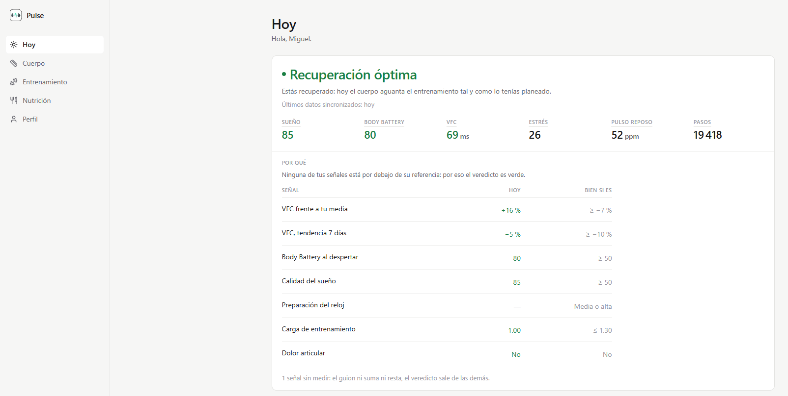
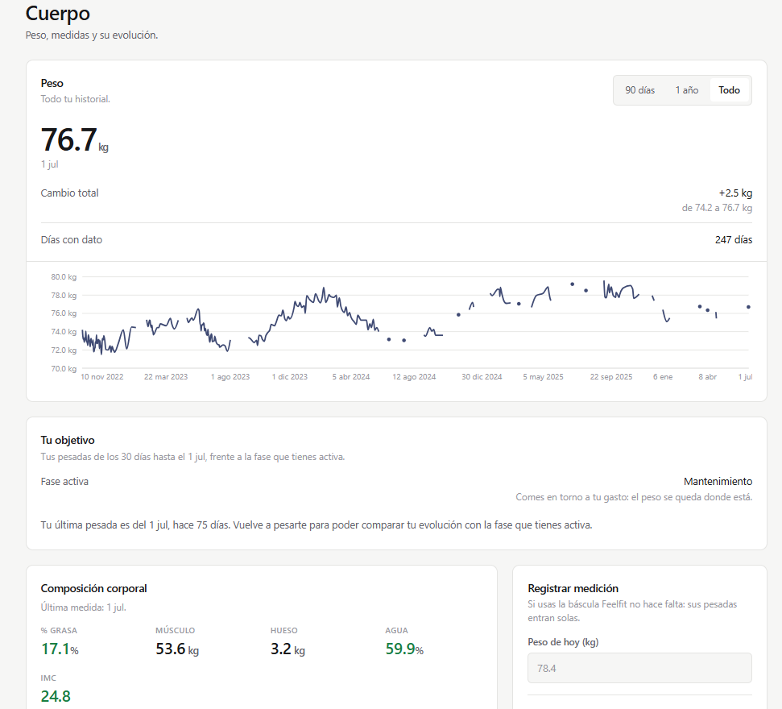
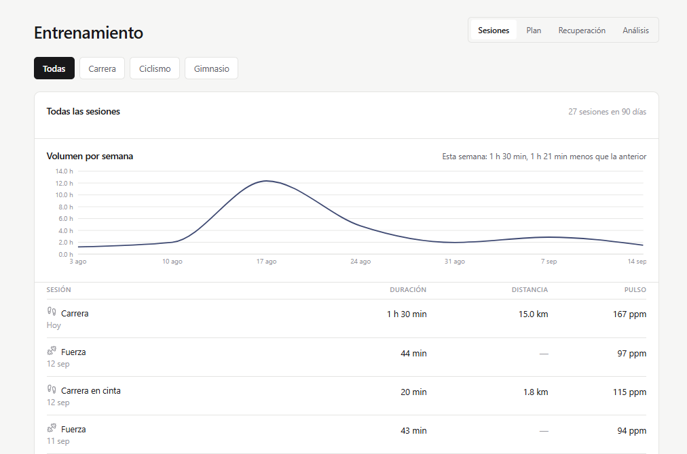
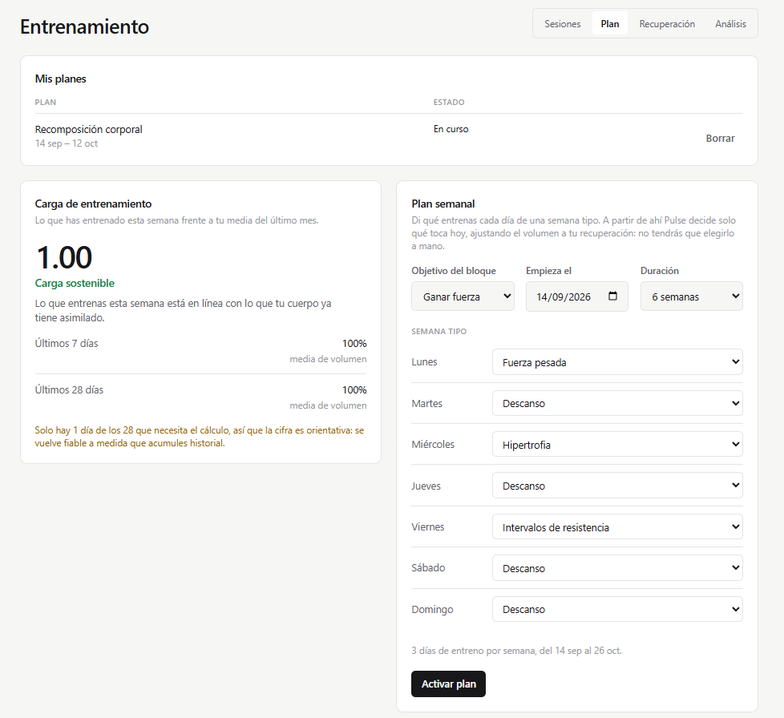
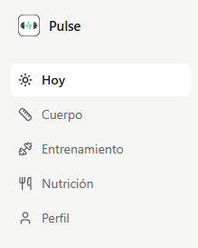

# Pulse — Entrenador personal con IA (multi-deporte, multi-objetivo)


> App personal (móvil + escritorio) que actúa como entrenador y nutricionista, integrando datos reales de Garmin, báscula Feelfit, wger (ejercicios) y objetivos múltiples (fuerza, hipertrofia, running, artes marciales, composición corporal, cortes de peso).

<p align="center">
  
</p>

Cada cifra del reloj se puede pulsar y lleva a su propio detalle (tendencia de 7/30/90 días con eje y unidad, y el histórico noche a noche o día a día); el veredicto de recuperación explica de qué señales sale, no solo el color.

## Descargar

La build de escritorio (Windows) se publica en [**GitHub Releases**](https://github.com/megatron54/Pulse/releases) — ver [`CHANGELOG.md`](CHANGELOG.md) para el detalle de cada versión. Es una app nativa (Tauri) que empaqueta el backend como sidecar + SQLite local, pensada para un único usuario en su propia máquina (no un producto multiusuario).

## Estado del proyecto

**Fase actual (v0.2.0):** aplicación funcional en uso real (mono-usuario), con Garmin Connect y báscula Feelfit reales conectados y sincronizando automáticamente. Backend (FastAPI) + frontend (Next.js) + Postgres, todo en Docker o local — más una build de escritorio nativa (Tauri) en marcha. Desarrollo continuo con TDD estricto, revisión de código antes de cada merge, y verificación manual real (Playwright) además de tests automatizados.

**Documento vivo de seguimiento:** [`02-roadmap/03-vision-produccion.md`](02-roadmap/03-vision-produccion.md) — épicas hechas/pendientes, hallazgos de investigación, decisiones de diseño. Léelo antes de retomar el trabajo para no repetir investigación ya hecha.

## Arquitectura en 3 capas

1. **Capa 1 — Motor de reglas determinista** (`backend/engine/`): decide nutrición, progresión, periodización, readiness (semáforo RED/YELLOW/GREEN) y guardrails de seguridad. Sin llamadas a red ni a IA. Cobertura de tests ~100% — es la capa que toma decisiones que importan.
2. **Capa 2 — Servicios/API** (`backend/services/`, `backend/api/`): orquesta la Capa 1 con datos reales (Garmin, Feelfit, wger) y los expone vía REST.
3. **Capa 3 — Coach conversacional** (`backend/coach/`): IA (Gemini, con fallback determinista) que **explica** las decisiones ya tomadas por la Capa 1 — nunca decide por su cuenta.

Detalle completo en [`01-arquitectura/`](01-arquitectura/).

## Qué funciona hoy

- **Garmin Connect real**: único mecanismo de alta de usuario (sin onboarding manual). El backfill histórico de 90 días corre en background (no bloquea el alta), con sync incremental frecuente (cada 2h) del día en curso además del nocturno completo, y un endpoint de sync manual bajo demanda ("actualizar ahora") — recovery (HRV/Body Battery/sleep/training readiness/estrés minuto a minuto), pasos y actividades. Reconexión inteligente: una cuenta de Garmin ya vinculada (detectada por email) se reconecta sin duplicar el usuario ni repetir el backfill — evita el rate-limiting que causaba el flujo anterior. Profundización gradual del histórico hacia atrás (job nocturno, hasta ~2 años) para no depender solo de los últimos 90 días. Corre como servicio Docker propio (`scheduler`).
- **Báscula Feelfit real**: conexión custom vía la API de la báscula (formulario propio en la página Cuerpo, sin pasar por Samsung Health/Apple Health/Google Fit/Health Connect), sincronización nocturna automática de la composición de bioimpedancia completa (peso, % grasa, músculo, hueso, % agua, BMI), no solo peso.
- **wger**: catálogo de ejercicios (el diario de comidas ya no usa wger, ver más abajo).
- **Motor de reglas**: nutrición (TDEE + macros por fase), planes de fase de peso con duración determinada (déficit/mantenimiento/recomposición/superávit — el sistema recomienda, el usuario confirma), progresión (1RM, doble progresión, autorregulación RIR/APRE), periodización (readiness diario, ACWR real), guardrails (deload forzado, pausa de déficit por mala recuperación sostenida).
- **Diario de hábitos** correlacionado con recovery (estilo WHOOP Journal), resumen periódico de tendencias.
- **Frontend**: navegación de 5 secciones (Hoy/Cuerpo/Entrenamiento/Nutrición/Perfil — Entrenamiento fusiona Sesiones, Plan, Recuperación y Análisis en pestañas; Perfil gestiona datos propios, tema claro/oscuro y las conexiones a Garmin y Feelfit), con cada página respondiendo a una sola pregunta ("Hoy" = cómo estoy y qué hago hoy, nada más). Gráficas con eje, unidad y leyenda; datos tabulares en tablas de verdad; nada de texto truncado; ausencia de dato mostrada como ausencia y nunca como cero. Construido sobre un design system propio y documentado — ver [`frontend/README.md`](frontend/README.md) y [`01-arquitectura/05-design-system-v3.md`](01-arquitectura/05-design-system-v3.md).

<table>
<tr>
<td width="50%">

<br /><sub>Peso, objetivo de fase y composición corporal, todo frente a tu histórico real.</sub>
</td>
<td width="50%">

<br /><sub>Volumen semanal y cada sesión, con icono de deporte y sin nada truncado.</sub>
</td>
</tr>
<tr>
<td width="50%">

<br /><sub>Carga de entrenamiento real frente a tu media, y el plan semanal que decide qué toca hoy.</sub>
</td>
<td width="50%">

<br /><sub>Cinco secciones, cada una respondiendo a una sola pregunta.</sub>
</td>
</tr>
</table>

## Quickstart

```powershell
cp .env.example .env
docker compose up -d --build
# o, equivalente y con espera automatica a que todo quede listo + apertura del navegador:
.\start.ps1
```

- Backend: http://localhost:8000 (docs interactivas en `/docs`)
- Frontend: http://localhost:3000

Esto levanta los 4 servicios (Postgres, backend, frontend, y el scheduler nocturno de Garmin/Feelfit) — `docker compose ps` debe mostrar los 4 como `healthy`. Ver [`DEPLOYMENT.md`](DEPLOYMENT.md) para variables de entorno y verificación. Para desarrollo local sin Docker del backend/frontend (solo Postgres en Docker), ver [`backend/README.md`](backend/README.md) y [`frontend/README.md`](frontend/README.md).

### App de escritorio (Tauri)

Prueba de concepto funcional: backend empaquetado como sidecar + SQLite local, sin depender de Docker/Postgres. Ver [`frontend/src-tauri/`](frontend/src-tauri/) y [`00-research/09-app-nativa-escritorio.md`](00-research/09-app-nativa-escritorio.md). Para generar el instalable localmente:

```powershell
cd frontend
npm run tauri build
# instaladores en frontend/src-tauri/target/release/bundle/{msi,nsis}/
```

## Índice de documentación

### 📚 00-research/ — Investigación profunda
1. [01-resumen-ejecutivo.md](00-research/01-resumen-ejecutivo.md) — TL;DR de todo lo investigado
2. [02-mercado-apps-existentes.md](00-research/02-mercado-apps-existentes.md) — Competencia y hueco de mercado
3. [03-garmin-integracion.md](00-research/03-garmin-integracion.md) — Cómo extraer datos de Garmin para uso personal
4. [04-reutilizacion-open-source.md](00-research/04-reutilizacion-open-source.md) — Qué reutilizar vs. qué construir
5. [05-analisis-corporal-foto.md](00-research/05-analisis-corporal-foto.md) — Estimación de composición corporal por foto
6. [06-periodizacion-ciencia-deportiva.md](00-research/06-periodizacion-ciencia-deportiva.md) — Ciencia de periodización multi-objetivo
7. [07-arquitectura-coach-ia.md](00-research/07-arquitectura-coach-ia.md) — Patrones de arquitectura para el coach conversacional
8. [08-nutricion-recovery-ciencia.md](00-research/08-nutricion-recovery-ciencia.md) — Evidencia científica sobre sueño/HRV y ajuste de calorías/macros (Épica I)
9. [09-app-nativa-escritorio.md](00-research/09-app-nativa-escritorio.md) — Comparación Tauri/Electron/Capacitor para migrar a app nativa de escritorio (Épica K)

### 🏗️ 01-arquitectura/ — Diseño técnico
1. [01-arquitectura-general.md](01-arquitectura/01-arquitectura-general.md) — Las 3 capas del sistema
2. [02-stack-tecnologico.md](01-arquitectura/02-stack-tecnologico.md) — Decisiones de stack
3. [03-modelo-datos.md](01-arquitectura/03-modelo-datos.md) — Esquema de datos principal

### 🗺️ 02-roadmap/ — Plan de ejecución
1. [01-fases-desarrollo.md](02-roadmap/01-fases-desarrollo.md) — Roadmap original por fases (MVP → v1 → v2)
2. [02-plan-autonomo.md](02-roadmap/02-plan-autonomo.md) — Plan de ejecución autónomo por fases (A-J)
3. **[03-vision-produccion.md](02-roadmap/03-vision-produccion.md)** — Documento vivo: estado real de cada épica, hallazgos, decisiones pendientes. **Empieza aquí.**
4. [04-plan-desarrollo-siguiente-fase.md](02-roadmap/04-plan-desarrollo-siguiente-fase.md) — Plan de desarrollo priorizado y secuenciado a partir del backlog de `03-vision-produccion.md`

## Autor

**Miguel Serra Ferrando** — Telecommunications Engineer
[GitHub](https://github.com/megatron54) · [LinkedIn](https://www.linkedin.com/in/miguel-serra-ferrando) · [Email](mailto:miguel.serra.ferrando@gmail.com)
